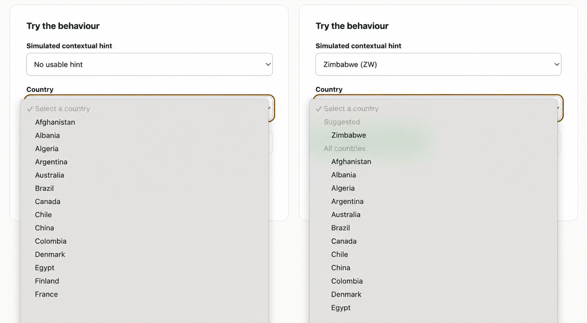

# Country suggestion pattern

Country dropdowns are commonly alphabetical. That is predictable, but it makes
people whose countries appear late in the alphabet repeatedly scroll or search.

This repository demonstrates a deliberately small alternative:

1. Accept one contextual country hint from the host application.
2. Show that country in a clearly labelled **Suggested** group.
3. Keep every other country in its existing order.
4. Keep the empty placeholder selected until the user chooses.
5. Do nothing when the hint is absent or unusable.

The hint is a convenience, not an answer. It must never decide the user's
country for them.

> [!IMPORTANT]
> This is a reference pattern and recipe collection, not a package to install.
> The intended distribution path is through existing country-selector APIs and
> upstream documentation.

## Demo

Open [`index.html`](./index.html) through any static web server. For example,
run `npm run demo` and visit `http://localhost:8000`.

The demo uses a native `<select>` and an illustrative subset of countries. It
contains no analytics, network calls, cookies, local storage, or IP lookup.



*Without a usable hint, the list remains untouched. With a valid hint,
Zimbabwe becomes easier to reach without becoming the selected value.*

## Behavioural contract

The reference implementation accepts an already ordered array of objects with
ISO 3166-1 alpha-2 `code` properties and one optional country hint. It returns:

- zero or one suggested country;
- all remaining items in their original relative order.

It does not:

- select a value;
- alphabetise or localise country names;
- provide or maintain a country database;
- inspect the browser, IP address, cookies, or account;
- mutate its input;
- render or modify a form control.

The host remains responsible for deciding which countries are valid for the
field and where its hint comes from. The reference code merely makes the
ordering rule executable.

## Safe UI requirements

- Preserve a blank placeholder as the first direct child of a required native
  `<select>`. Otherwise the browser can treat the first country as selected.
- Prefer labelled groups such as **Suggested** and **All countries** over a
  selectable row made from dashes.
- Do not reorder after the user has selected a value or begun interacting.
- Do not dispatch synthetic `input` or `change` events.
- Preserve the form's label, name, value, validation, autocomplete, disabled
  state, and submission behaviour.
- Use the hint only for fields where it is relevant. Current location may be a
  reasonable hint for a shipping address, but not for nationality, citizenship,
  residency, or country of birth.

The native-select rules behind the placeholder and accessibility guidance are
documented in [MDN's `<select>` reference](https://developer.mozilla.org/en-US/docs/Web/HTML/Reference/Elements/select).

## Hint priority

Use the first applicable signal:

1. An existing value explicitly chosen by the user: preserve it and skip the
   suggestion.
2. A context-specific saved preference, such as a recent shipping country.
3. A country header supplied by trusted hosting or CDN infrastructure.
4. An explicit region in a locale such as `en-GB`.
5. No hint, leaving the ordinary list unchanged.

Do not guess a country from a language-only locale such as `en`, `es`, or `fr`.
Do not add an external IP geolocation request merely for this pattern.

See [`RECIPES.md`](./RECIPES.md) for infrastructure and existing-library
examples.

## Reference API

```js
import { partitionCountrySuggestion } from "./reference.js";

const result = partitionCountrySuggestion(countries, "GB");
// result.suggested: the matching country, if present
// result.remaining: every other item, in its original order
```

An invalid or unavailable hint produces an empty `suggested` array and an
unchanged copy of the input list.

## Development

Requires Node.js 20 or newer. There are no dependencies to install.

```sh
npm test
npm run demo
```

The automated tests cover absent, malformed, mixed-case, unknown and
late-alphabet hints, duplicate input codes, stable ordering, and input
immutability.

## Upstream strategy

Prefer a small documentation contribution that combines an existing priority
option with an empty placeholder over a new dependency or abstraction.

Initial targets:

1. Rails [`country_select`](https://github.com/countries/country_select)
2. [`intl-tel-input`](https://github.com/jackocnr/intl-tel-input)
3. [`django-countries`](https://github.com/SmileyChris/django-countries), only
   if its already extensive dynamic-ordering documentation has a concrete gap
4. [`react-country-region-selector`](https://github.com/country-regions/react-country-region-selector)
   and its [vanilla counterpart](https://github.com/country-regions/country-region-selector)
5. Symfony [`CountryType`](https://symfony.com/doc/current/reference/forms/types/country.html),
   if the maintainers consider a country-specific recipe appropriate

## Licence

[MIT](./LICENSE) © Chris Larkin
